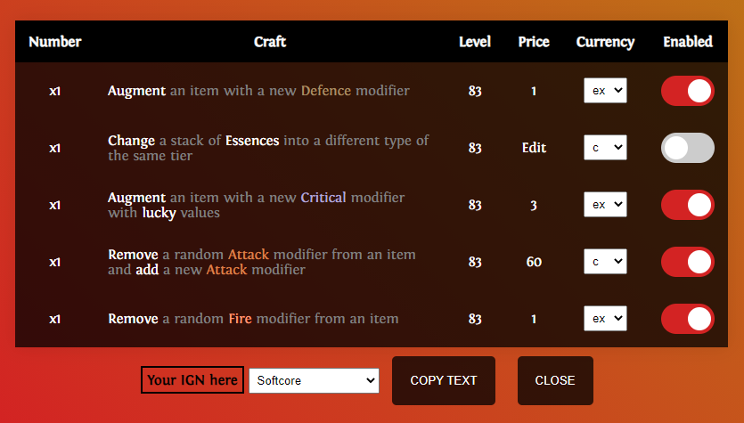

Harvest Craft Generator by thmour
===

About
==

This is an Electron App that uses computer vision tools (OCR - Tesseract)
to analyse a Path of Exile Screenshot to extract the Harvest crafts in it
and convert them to a ready-to-paste text for the Discord channel TFT (The Forbidden Trove)

Details
==

This app is in testing mode (testing -> alpha -> beta) and I would like some feedback on different resolutions.
This app currently works on 1440p and the screenshot segments checked for crafts have relative position. If PoE
has the same scaling for every resolution then the relative positions should work on different resolutions.

How to Use
==

Open up your harvest craft tab on the left side (when inventory is shown) and hit **Ctrl+Shift+D** (you can change it on tray settings). Your mouse will move
temporarily to the middle of the top craft, it will scroll up, take a screenshot, scroll down if crafts are more than 5, take a screenshot again and
when the texts are recognised, a pop-up window will open with the crafts:

If you are on fullscreen mode, since it is focused, windows will alt-tab you to the pop-up.
If you just want the pop-up to remain on the screen, you must switch to one of the window modes in PoE.
If you have a multi-monitor setup, the screenshot will be of the screen on where the mouse is.

In the above table you will see the number of the crafts. Currently, if the levels don't match you won't get x2
but both crafts x1 on different rows with different level displayed.

Click on `Edit` to change your price and select `c` or `ex` on the following dropdown menu for the price type.

You can enable and disable crafts from the text to copy by clicking on the `Enabled` buttons.

Click to input your in-game name and select your league. If the in-game name is left blank, the app will print `Pm for info` instead.

Lastly, click the `Copy Text` button and the then go to Discord and paste the resulting text.

Install
==

Head to the [releases](https://github.com/thmour/Harvest-Craft-Generator/releases) page and download the zip file.
Extract the contents and run the `horticrafting-generator.exe`. A blue system tray icon will appear where you can
check out some info or exit the app.

Roadmap
==

* Better formatting
* Better dropdown menu to fit window style
* Save craft prices
* Add `Can Stream` checkbox
* Test on different resolutions

